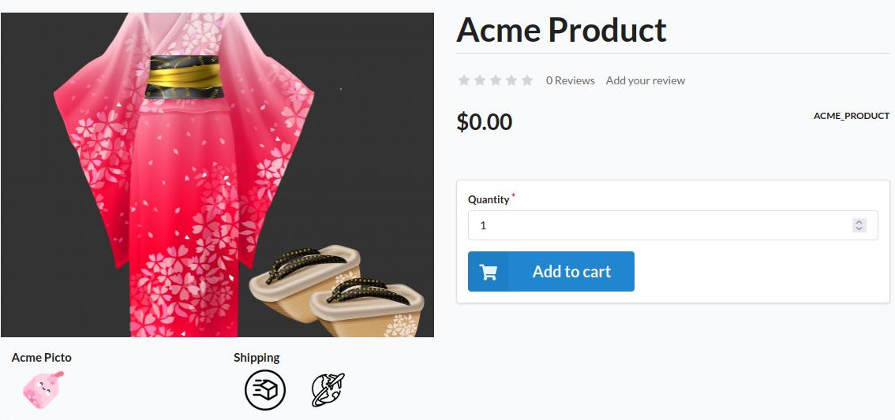
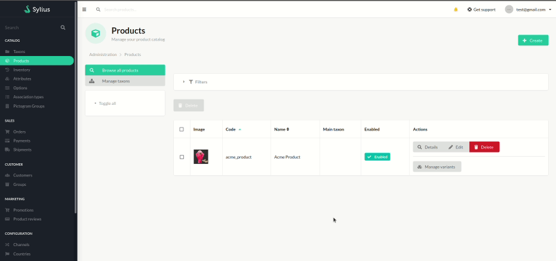

<p align="center">
</p>


<h1 align="center">Asdoria Pictogram Bundle</h1>

<p align="center">A plugin to create, group and associate pictograms with products</p>

## Features

+ Create groups of pictograms using your own images
+ Easily customize which pictograms to display from the product configuration page
+ Images are automatically displayed on the product's store page

<div style="max-width: 75%; height: auto; margin: auto">



</div>


<div style="max-width: 75%; height: auto; margin: auto">

Toggling the pictograms to display for a product


</div>


## Installation

---
1. Add the repository to composer.json

```JSON
"repositories": [
    {
        "type": "git",
        "url": "https://github.com/pvasdoria/asdoriasyliuspictogramplugin.git"
    }
],
```
2. run `composer require asdoria/sylius-pictogram-plugin`


3. Add the bundle in `config/bundles.php`. You must put it ABOVE `SyliusGridBundle`

```PHP
Asdoria\SyliusPictogramPlugin\AsdoriaSyliusPictogramPlugin::class => ['all' => true],
[...]
Sylius\Bundle\GridBundle\SyliusGridBundle::class => ['all' => true],
```

4. Import routes in `config/routes.yaml`

```yaml
asdoria_pictogram:
    resource: "@AsdoriaSyliusPictogramPlugin/Resources/config/routing.yaml"
    prefix: /admin
```

5. Import config in `config/packages/_sylius.yaml`
```yaml
imports:
    - { resource: "@AsdoriaSyliusPictogramPlugin/Resources/config/config.yaml"}
```
6. In `src/Entity/Product/Product.php`. Import `Asdoria\SyliusPictogramPlugin\Traits\PictogramsTrait` and initialize a pictogram collection in the constructor

```PHP

// ...

use Asdoria\SyliusPictogramPlugin\Traits\PictogramsTrait;

/**
 * @ORM\Entity
 * @ORM\Table(name="sylius_product")
 */
class Product extends BaseProduct
{
    use PictogramsTrait;

    public function __construct()
    {
        parent::__construct();
        $this->initializePictogramsCollection();
    }
    
    // ...
}
```
7. run `php bin/console do:mi:mi` to update the database schema

## Usage

1. In the back office, under `Catalog`, enter `Pictogram Groups`. Create a group using a unique code
2. In `Pictogram Groups`, click `Modify Pictograms` to create/delete images for this group
3. Go to a product's edit page, then click the `Pictograms` tab in the sidebar. Here you can toggle which pictograms you wish to display


